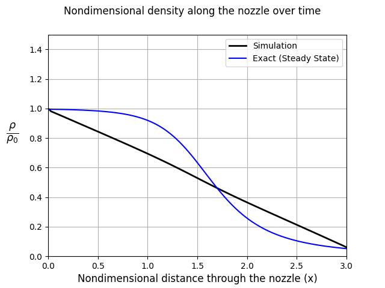
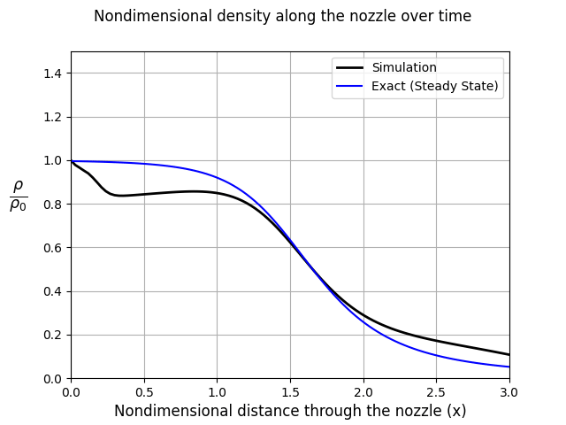
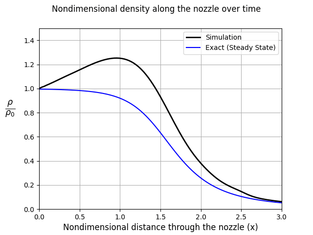
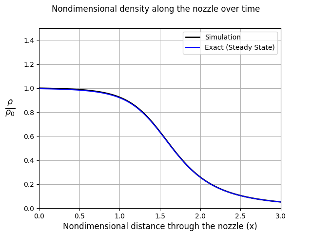

# Introduction
This code contains a solver for a quasi-one dimensional flow simulation.
The solver was done following the book "Computational Fluid Dynamics: The Basics with Applications" by John D. Anderson Jr.
The flow problem is stated in Chapter 7 of the book.
The results obtained from this solver match pretty closely to the results shown in the book.

The solver is written in rust with minimal dependencies on other libraries (for now just on serde which is used to write the simulation data to disk).
And the post-processing code is written in Python.

# Structure
This code is structured in the following way:

* The solver code is in **src/main.rs**
* The post-processing code is in **simulation/plotting.py**


# How use the solver
The solver will produce a folder called **output** where the solution information at different steps is stored.
It is recommended to run the solver inside the **simulation** folder so that the output folder is created inside the simulation folder.
This is useful because the post-processing code uses the output folder inside the simulation folder to create the plots.

So, to run the code first go to the simulation folder:

```bash
cd simulation
```

Then run the solver

```bash
cargo run --release
```

Finally, to see the output of the solver run the post-processing code:

```bash
python plotting.py
```

This will then show a gif of the nondimensional density along the nozzle over time.


Here are some frames of the resulting gif:





